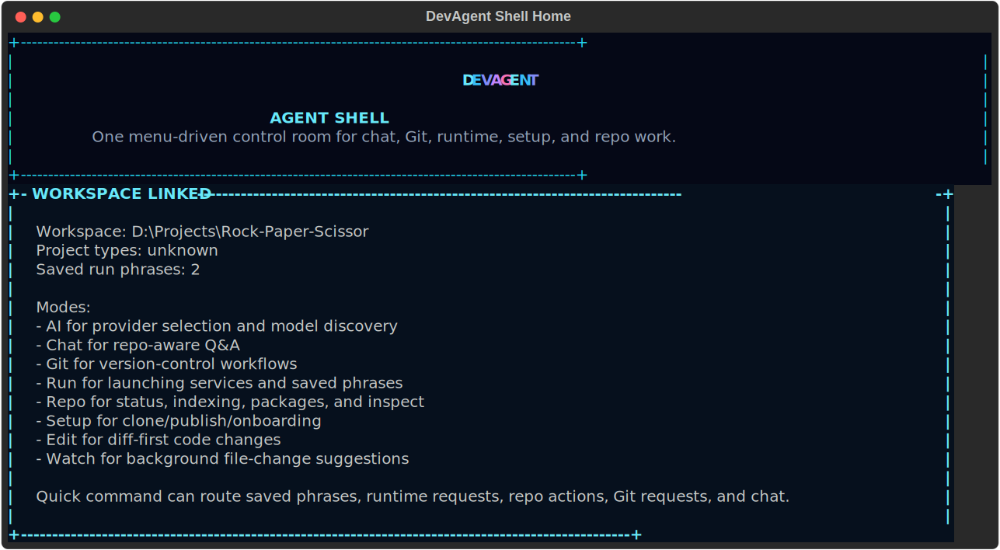
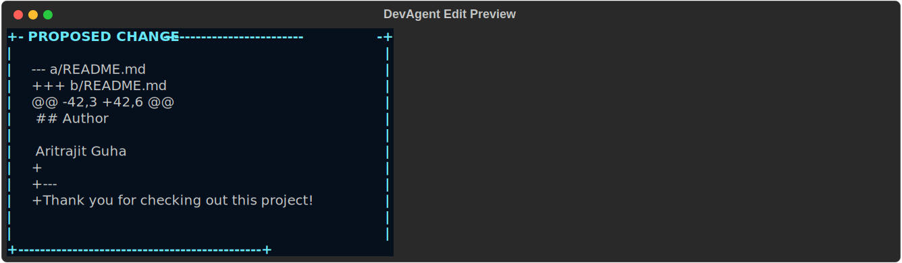
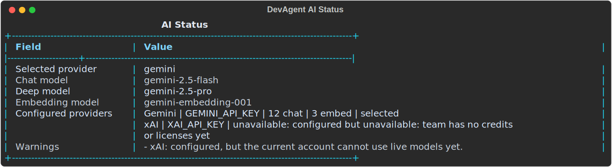

# DevAgent CLI

DevAgent CLI is a local-first developer assistant for real project work. It can
bind to a workspace, index the codebase, answer repo-aware questions, propose
diff-first edits, guide common Git flows, launch local services, and let you
pick which AI provider and models power those workflows.



## Why this project exists

Raw Git, raw shells, and raw AI chat windows all work, but they each leave a
gap:

- Git is powerful, but it is not especially friendly when you want the common
  flow to feel calm and obvious.
- A plain AI chat window can answer questions, but it often loses project
  grounding unless you keep re-explaining the repo.
- Local app setup is repetitive, and people keep retyping the same commands to
  start projects, inspect status, and move between Git tasks.

DevAgent exists to close those gaps without trying to replace your whole tool
stack. It gives you:

- a guided shell when you want prompts instead of memorizing commands
- a direct CLI when you already know the exact action you want
- repo-aware chat and edit flows that work against a bound workspace
- a simpler Git layer for common pulls, pushes, commits, PRs, and merge
  recovery
- AI provider selection without hand-editing model choices every time

## What DevAgent can do

### Interactive shell

Running `devagent` opens a menu-driven shell when a workspace is already bound.
That shell is designed for the "just help me do the next thing" workflow:

- `AI` for provider and model selection
- `Chat` for repo-aware questions
- `Git` for guided common Git tasks
- `Run` for starting services and saved launch phrases
- `Repo` for status, indexing, packages, and inspect
- `Setup` for clone and publish flows
- `Edit` for diff-first code changes
- `Watch` for file-change monitoring
- `Quick command / phrase` for natural-language shortcuts

### Direct CLI

If you prefer explicit commands, DevAgent also exposes a full CLI surface. The
main families are:

- `ai`
- `workspace`
- `setup`
- `new`
- `chat`
- `run`
- `git`
- `commit`
- `edit`
- `index`
- `packages`
- `inspect`
- `watch`

The detailed command reference lives in [CLI_GUIDE.md](CLI_GUIDE.md).

### Repo-aware chat

`devagent chat "..."` answers questions against the active workspace instead of
just guessing from general knowledge. This is why binding and indexing matter:
they give the assistant repo context before it starts talking.

Deep chat mode goes further. It uses the saved deep model for the active
provider and asks for broader retrieval, so the answer is both richer and more
grounded in more of the codebase.

### Diff-first edit flow

`devagent edit "..."` does not silently rewrite files. It proposes a unified
diff first, shows you what will change, and only applies it after confirmation
unless you pass `--yes`.

That behavior exists to keep AI edits inspectable instead of magical.



### Guided Git flows

DevAgent focuses on common Git work:

- see what changed
- stage all or specific paths
- create and switch branches
- generate better commit messages from the actual diff
- pull the current branch from its tracked remote
- push the current branch cleanly
- preview and open PRs
- inspect, abort, and continue merges

The goal is not to replace every advanced Git command. The goal is to make the
everyday path simpler than raw Git plumbing.

### Run phrases and service launch

DevAgent can detect launchable services in a workspace, start them, and save
natural-language phrases for repeated runs. This is why `run save` exists: so
you can teach DevAgent how you like to start a project without cluttering the
project itself.

### AI provider and model selection

DevAgent currently supports these providers:

- Gemini
- xAI

It can detect providers from the API keys you already have, list visible models
for those providers, and save a default provider/model choice for chat, edit,
and related AI-backed features.



## Install with `pipx`

### Prerequisites

Install these first:

- Python 3.11 or newer
- `pipx`
- Git
- GitHub CLI (`gh`) if you want DevAgent to publish local projects or create
  pull requests through GitHub

### Fresh install

```cmd
pipx install git+https://github.com/Aritrajit-Guha/DevAgent-CLI.git
```

### Upgrade an existing install

```cmd
pipx upgrade devagent-cli
```

### Reinstall from GitHub

If `pipx upgrade` does not pull the latest repo state you expect, do a clean
reinstall:

```cmd
pipx uninstall devagent-cli
pipx install git+https://github.com/Aritrajit-Guha/DevAgent-CLI.git
```

Use reinstall when you want to be absolutely sure your `pipx` environment is
using the latest GitHub source instead of an older cached state.

## API keys and AI setup

The simplest recommended setup is Gemini-only.

### Supported provider keys

DevAgent currently looks for these provider keys:

- `GEMINI_API_KEY`
- `GOOGLE_API_KEY`
- `XAI_API_KEY`

### Gemini model environment variables

These are the current Gemini model-related environment variables:

- `GEMINI_MODEL_FAST`
- `GEMINI_MODEL`
- `GEMINI_MODEL_DEEP`
- `GEMINI_EMBEDDING_MODEL`

`GEMINI_MODEL_FAST` and `GEMINI_MODEL` both act as the chat-model override.

### Simplest practical setup

Create a `.env` file from the example:

```cmd
copy .env.example .env
```

Then set at least:

```dotenv
GEMINI_API_KEY=your_key_here
```

If you only have a Gemini key, DevAgent will still work fine and will only use
Gemini.

### Choosing provider and models from DevAgent

Use these commands:

```cmd
devagent ai status
devagent ai models --refresh
devagent ai use --provider gemini
devagent ai use --provider gemini --model gemini-2.5-flash --deep-model gemini-2.5-pro --embedding-model gemini-embedding-001
```

If you also have xAI configured:

```cmd
devagent ai use --provider xai --model grok-3-mini --deep-model grok-3-mini
```

### Important caveat about provider availability

A provider key being present does not automatically mean the provider is usable
right now. For example:

- the key may be valid but tied to an account with no credits
- the provider may allow auth but block model access
- model discovery may be unavailable temporarily

DevAgent now treats those as warnings instead of crashing, but the docs should
set the expectation clearly: configured and available are not always the same
thing.

## First run

### 1. Bind a workspace

```cmd
devagent workspace bind "D:\Vs code Projects\Rock-Paper-Scissor"
devagent workspace status
```

Most DevAgent commands work against the currently bound workspace.

### 2. Check AI status

```cmd
devagent ai status
```

This tells you:

- which providers are configured
- which provider is selected
- which chat, deep, and embedding models DevAgent will use

### 3. Build the code index

```cmd
devagent index
```

The index is what powers grounded repo chat and edit retrieval. Without it,
DevAgent has less useful repo context.

### 4. Ask the repo a question

```cmd
devagent chat "Explain this project"
devagent chat "Where is the CLI implemented?" --deep
```

### 5. Open the shell

```cmd
devagent
```

If no workspace is bound, or the saved workspace path no longer exists, DevAgent
shows recovery guidance instead of crashing.

## Common workflows

### Use the shell when you want guidance

Open it with:

```cmd
devagent
```

Use the shell when you want:

- menus
- guided prompts
- plain-English Git choices
- natural-language quick commands

See [SHELL_GUIDE.md](SHELL_GUIDE.md) for the full shell reference.

### Ask repo questions from the CLI

```cmd
devagent chat "Explain the architecture"
devagent chat "Which files control the shell UX?"
devagent chat "Give me a deeper summary of the Git flow" --deep
```

### Make a safe code change

```cmd
devagent edit "Add a thank you line at the end of README.md"
```

DevAgent shows the diff first, then asks whether to apply it.

### Stage, suggest, commit, push, and open a PR

```cmd
devagent git status
devagent git add
devagent commit suggest
devagent git commit
devagent git push
devagent git pr preview
devagent git pr create
```

### Clone or publish a project

Clone an existing repo:

```cmd
devagent setup clone https://github.com/user/repo --target "D:\Projects" --install-deps
```

Publish a local project:

```cmd
devagent setup publish "D:\Projects\MyApp" --name myapp --private
```

Guided version:

```cmd
devagent new project
```

### Launch your app

```cmd
devagent run start --open-browser
devagent run save "Start the app" --open-browser
devagent run start "Start the app"
```

## Which guide should you read?

- [CLI_GUIDE.md](CLI_GUIDE.md): every explicit CLI command with examples
- [SHELL_GUIDE.md](SHELL_GUIDE.md): every shell mode, shell command, and guided
  interaction pattern

Use this README for onboarding and product understanding. Use the other two
guides as task references once you are already moving.

## Troubleshooting and gotchas

### `devagent` says no workspace is bound

Bind one first:

```cmd
devagent workspace bind "D:\Projects\MyApp"
```

### The old bound workspace was deleted

DevAgent now treats this as a recoverable state. Rebind it:

```cmd
devagent workspace bind "D:\Projects\MyApp"
```

or start fresh with:

```cmd
devagent new project
```

### `devagent ai` shows provider warnings

That usually means one of these:

- the API key is missing
- the API key is valid but the account has no credits or license access
- the provider is temporarily unavailable

Try:

```cmd
devagent ai status --refresh
devagent ai models --refresh
```

### `devagent status` does not exist

Use:

```cmd
devagent workspace status
```

### Edit apply failed after a valid-looking diff

Recent fixes hardened the apply pipeline, but if a proposed diff still fails:

- retry the edit once
- make the instruction more specific about the target file
- inspect the proposed diff before applying

### `devagent` behaves differently in one terminal than another

That usually means the shell executable is the same but the environment is not.
Check:

- whether `PATH` changed after the terminal host was opened
- whether provider keys are available in that session
- whether `pipx` paths are visible in that session

## Local development

If you want to work on DevAgent itself instead of only using it through `pipx`,
set up a local editable environment:

```powershell
python -m venv .venv
.\.venv\Scripts\activate
pip install -e ".[dev]"
```

Useful local checks:

```powershell
devagent --help
devagent workspace bind .
devagent workspace status
python -m pytest
```

## Final note

DevAgent is meant to make local developer workflows feel more grounded, more
guided, and less brittle. The shell, the CLI, the Git flows, and the AI layer
all exist for the same reason: to help you stay in flow while still keeping the
work visible and controlled.
