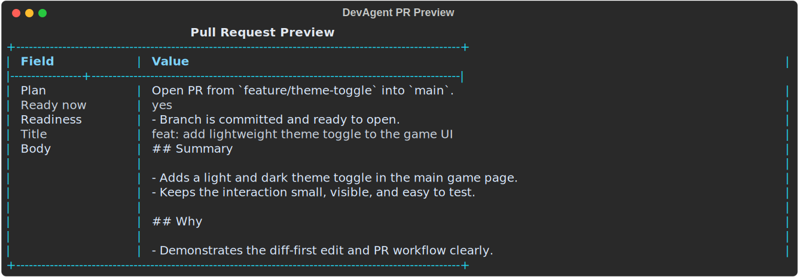

# DevAgent Shell Guide

This guide covers the interactive shell opened by:

```cmd
devagent
```

If you want the full explicit command reference instead, use
[CLI_GUIDE.md](CLI_GUIDE.md). If you want the high-level product overview and
installation steps first, start with [README.md](README.md).


## What the shell is for

The shell is DevAgent's guided interface. Use it when you want prompts, menus,
and calmer workflows instead of typing exact commands.

The shell is especially useful for:

- first-time users
- Git flows where you want guidance
- switching AI providers and models
- quick repo questions
- diff-first edits
- launch phrases and app startup flows

## How shell startup works

### When a workspace is already bound

Running:

```cmd
devagent
```

opens the shell home screen.

### When no workspace is bound

DevAgent does not crash. It tells you to recover with one of these:

```cmd
devagent workspace bind <path>
devagent new project
```

### When the saved workspace path was deleted

DevAgent treats that as a recoverable state too. It shows the missing path and
guidance for rebinding or starting a new setup flow.

## Home menu

The shell home menu currently includes these entries:

| Mode | What it is for |
| --- | --- |
| `AI` | Choose providers and models, inspect visible models, reset saved AI settings |
| `Chat` | Ask repo-aware questions with session memory and deep mode |
| `Git` | Stage, branch, commit, pull, push, preview PRs, create PRs, recover merges |
| `Run` | Start detected services, save launch phrases, launch saved phrases |
| `Repo` | Show workspace status, reindex, inspect packages, run repo checks, rebind |
| `Setup` | Clone repos, publish local projects, run guided onboarding |
| `Edit` | Describe a change, inspect the diff, then confirm or skip |
| `Watch` | Watch the workspace for file changes and repo-aware prompts |
| `Quick command / phrase` | Route plain-English input to run, repo, Git, or chat |
| `Help` | Show the shell help summary |
| `Exit` | Leave DevAgent |

## AI mode

AI mode is the shell surface for provider and model selection.

### Actions in AI mode

- `Show current AI status`
- `Show available models`
- `Choose the default provider`
- `Choose the default chat model`
- `Choose the default deep model`
- `Choose the embedding model`
- `Reset saved AI settings`
- `Back to home`

### What AI mode is doing

It lets you:

- see which providers are configured from your environment
- inspect the visible models for those providers
- save the provider/model choices DevAgent should use by default

### Typical AI flow

1. Open `AI`
2. Choose `Show current AI status`
3. Review the selected provider and models
4. Choose `Show available models`
5. Choose provider or model actions if you want to save new defaults


### Notes about provider warnings

If one provider is configured but unavailable, the shell should now show a
warning instead of crashing. This can happen when:

- the key is present but the provider account has no credits
- the provider is temporarily unavailable
- the provider exposes the account but not the current model catalog

## Chat mode

Chat mode is the repo-aware conversation surface.

When you enter it, DevAgent shows a small prompt and waits for natural-language
questions about the bound workspace.

### What Chat mode is best for

- understanding architecture
- finding where logic lives
- comparing related files or modules
- getting a broader explanation before making edits

### Slash commands

Chat mode supports these shell-native commands:

| Command | What it does |
| --- | --- |
| `/help` | Show the chat controls |
| `/deep` | Toggle deeper answer mode on or off |
| `/clear` | Clear the stored workspace chat memory |
| `/workspace` | Show the active workspace snapshot |
| `/menu` | Return to the shell home menu |
| `/exit` | Leave DevAgent entirely |

### What `/deep` really changes

Deep mode does two things:

- it uses the saved deep model for the active AI provider
- it asks for broader retrieval from the repo before answering

So deeper answers are richer because they use both a stronger model path and a
broader repo context pack.

### Chat examples

```text
chat > Explain the project structure
chat > Where is the Git routing implemented?
chat > How does edit apply work?
chat > /deep
chat > Give me a deeper walkthrough of the shell architecture
```

### Important routing note inside Chat mode

Chat mode checks slash commands first. It can also still detect a saved run
phrase before falling back to repo chat.

## Git mode

Git mode is the shell's guided Git surface. It is deliberately focused on the
common workflow instead of every advanced Git feature.

### Git actions currently available

- `See what changed and which branch you're on`
- `Stage everything for the next commit`
- `Stage a specific file or folder`
- `Create a branch for new work`
- `Switch to another branch safely`
- `Commit with an auto-generated message`
- `Suggest a commit message without committing`
- `Pull the latest changes into this branch`
- `Push this branch to GitHub`
- `Preview the PR title and description`
- `Open a PR for this branch`
- `Check merge conflicts`
- `Abort the current merge` when a merge is active
- `Continue the current merge after resolution` when a merge is active

### What the guided Git prompts do

They try to keep the common path simple:

- pull prefers the tracked upstream
- push prefers the tracked branch and only asks extra questions when needed
- PR preview/create auto-detect the likely repo flow and focus on the base
  branch plus readiness
- merge actions only appear when they are valid

### Commit suggestions

When you choose `Suggest a commit message without committing`, DevAgent builds a
subject and bullet preview from:

- changed files
- diff hunks
- likely project area
- likely impact

The shell preview is the same underlying commit analysis used by
`devagent commit suggest` and automatic Git commit generation.

### PR preview example



### Example Git workflow in shell

1. Open `Git`
2. Choose `See what changed and which branch you're on`
3. Choose `Stage everything for the next commit`
4. Choose `Suggest a commit message without committing`
5. Choose `Commit with an auto-generated message`
6. Choose `Push this branch to GitHub`
7. Choose `Preview the PR title and description`
8. Choose `Open a PR for this branch`

## Run mode

Run mode is the shell surface for launching apps and managing saved phrases.

### Actions in Run mode

- `Start detected stack`
- `Start a saved phrase`
- `Save detected stack as a phrase`
- `Save a custom command as a phrase`
- `List detected targets and saved phrases`
- `Forget a saved phrase`
- `Back to home`

### Why this mode exists

Projects often need the same launch steps over and over. Run mode lets DevAgent
remember those steps without forcing you to hardcode them into the project.

### Run mode examples

- save a whole detected stack as "Start the app"
- save a custom frontend command such as `npm run dev`
- start a saved phrase with optional browser opening

## Repo mode

Repo mode is the shell's workspace maintenance area.

### Actions in Repo mode

- `Show workspace status`
- `Reindex the workspace`
- `Show package dependencies`
- `Run inspect`
- `Rebind workspace`
- `Back to home`

### Why Repo mode matters

It groups the "check the current workspace" actions together so you do not need
to remember separate CLI commands during ordinary work.

## Setup mode

Setup mode handles onboarding and repository setup tasks.

### Actions in Setup mode

- `Clone a GitHub repo`
- `Publish a local project to GitHub`
- `Run the guided new project flow`
- `Back to home`

### What each path is for

- `Clone` is for an existing GitHub repo
- `Publish` is for a local project that should become a GitHub repo
- `Guided` is the friendlier prompt flow when you do not want to remember which
  setup route to use

## Edit mode

Edit mode is the shell surface for plain-English code changes with an explicit
diff preview.

### How Edit mode works

1. Enter `Edit`
2. Describe the change you want
3. DevAgent proposes a unified diff
4. You choose whether to apply it

That preview step exists to keep code edits visible and controlled.


### Example Edit prompts

- `Add a thank you line at the end of README.md`
- `Create a simple light/dark theme toggle button`
- `Fix the heading text in index.html`

### If edit apply fails

The shell now gives friendlier apply failures than before, but the most useful
next steps are still:

- retry once
- make the target file explicit
- inspect whether the diff context matches the real current file

## Watch mode

Watch mode monitors the workspace for file changes and prints lightweight
repo-aware prompts when things move.

### What Watch mode asks for

- polling interval

### What happens next

DevAgent watches the workspace until you stop it with `Ctrl+C`, then returns to
the shell.

## Quick command / phrase

This is one of the most useful parts of the shell when you want speed without
memorizing syntax.

### What it does

You type one plain-English line, and DevAgent tries to route it to the right
action.

### Routing order

Quick command routing currently works in this order:

1. slash-style shell command
2. saved run phrase match
3. runtime intent
4. repo action
5. Git intent
6. fallback to repo-aware chat

### Natural-language examples

These are good examples of what Quick command can route:

- `start the app`
- `launch the frontend`
- `stage all`
- `create branch feature/login`
- `switch to main`
- `suggest commit message`
- `pull`
- `push`
- `preview pr`
- `open pr`
- `workspace status`
- `inspect the repo`

### Important behavior to remember

If a saved run phrase matches what you typed, that match wins before repo chat.
That is intentional, because a saved phrase is treated like an explicit user
shortcut.

## Help

Choosing `Help` from the shell home menu shows the shell summary:

- what each mode is for
- which slash commands exist in chat
- how Quick command routing behaves

It is the shell-native orientation page when you forget where something lives.

## Exit

Choosing `Exit` leaves DevAgent. In Chat mode, `/exit` does the same thing.

## Common shell workflows

### First run after binding a project

1. Run `devagent`
2. Open `Repo` and review status
3. Open `AI` and confirm the provider/model setup
4. Open `Chat` and ask for a repo overview

### Ask questions, then make an edit

1. Open `Chat`
2. Ask where the target logic lives
3. Return with `/menu`
4. Open `Edit`
5. Describe the change
6. Review and apply the diff

### Common Git path

1. Open `Git`
2. Check status
3. Stage files
4. Review the commit suggestion
5. Commit
6. Push
7. Preview the PR
8. Open the PR

### Switch providers or models

1. Open `AI`
2. Show status
3. Show models
4. Set provider
5. Set chat or deep model

## Shell-specific troubleshooting

### The shell will not start

Check whether:

- a workspace is bound
- the saved workspace path still exists

If not, recover with:

```cmd
devagent workspace bind <path>
devagent new project
devagent setup clone <repo-url>
```

### AI mode shows warnings

That usually means the provider is configured but not truly available right now.
The shell should still work for the other available providers.

### Quick command answered with chat when you expected Git

Quick command only catches the currently supported intent phrases. If a natural
language Git phrasing is too unusual, open `Git` directly or use the explicit
CLI command.

### Edit mode showed a diff but apply failed

That usually means one of these:

- the file changed underneath the proposal
- the diff came back with malformed context
- the model produced an awkward patch shape

Retry with a more targeted instruction and mention the file path explicitly.

## Final note

The shell is the best DevAgent surface when you want guidance and momentum. The
CLI is the best surface when you want exact control. They share the same action
layer underneath, so the difference is mostly the interaction style, not the
core behavior.
